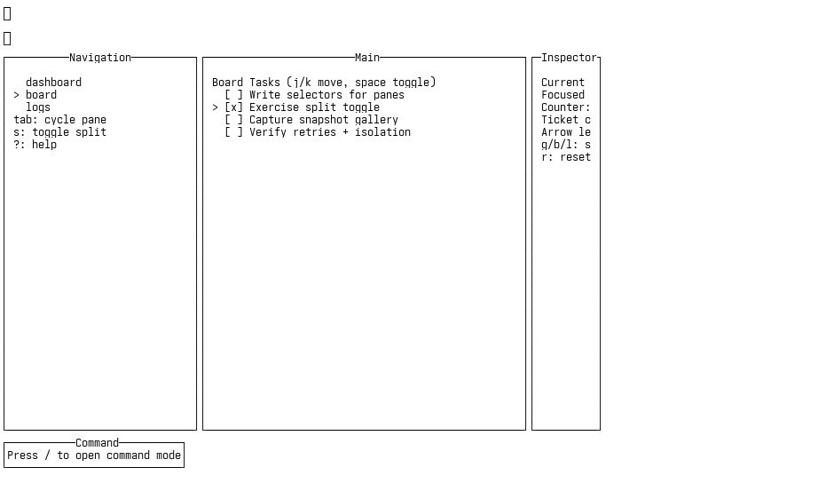
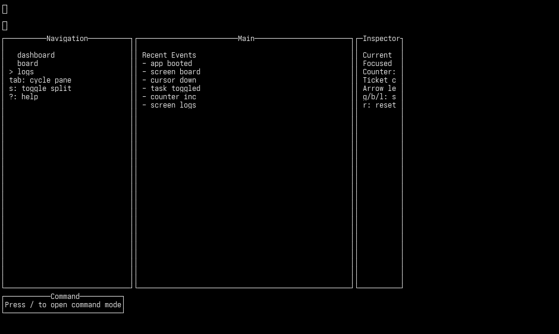

# tuispec

[](https://hackage.haskell.org/package/tuispec)
[](LICENSE)

Playwright-like black-box testing for terminal UIs over PTY.

`tuispec` is a Haskell library that lets you write reliable TUI tests as normal
Haskell programs. Interact with any terminal application via PTY — send
keystrokes, wait for text, and capture snapshots — without instrumenting the
target app.

## Example output

Snapshots captured from the included [Brick demo app](example/app/Main.hs)
using `tuispec`:




## Features

- **PTY transport** — tests interact with real terminal apps over PTY
- **Per-test isolation** — fresh PTY process per test, no shared state
- **Snapshot assertions** — baseline comparison with ANSI text + PNG artifacts
- **Text selectors** — `Exact`, `Regex`, `At`, `Within`, `Nth`
- **`tasty` integration** — tests are regular `tasty` test trees
- **JSON-RPC server** — agentic orchestration of TUIs via `tuispec server`
- **REPL sessions** — ad-hoc exploration with `withTuiSession`

## Quick start

Add `tuispec` to your `build-depends` and write a test:

```haskell
{-# LANGUAGE OverloadedStrings #-}

import Test.Tasty (defaultMain, testGroup)
import TuiSpec

main :: IO ()
main =
  defaultMain $ testGroup "demo"
    [ tuiTest defaultRunOptions "counter" $ \tui -> do
        launch tui (app "my-tui" [])
        waitForText tui (Exact "Ready")
        press tui (CharKey '+')
        expectSnapshot tui "counter-updated"
        press tui (CharKey 'q')
    ]
```

Run:

```bash
cabal test
```

## Building from source

```bash
cabal build
```

Run root smoke tests:

```bash
cabal test
```

Run the Brick demo integration suite:

```bash
cd example
cabal test
```

## DSL overview

### Actions

```haskell
launch    :: Tui -> App -> IO ()
app       :: FilePath -> [String] -> App
press     :: Tui -> Key -> IO ()
pressCombo :: Tui -> [Modifier] -> Key -> IO ()
typeText  :: Tui -> Text -> IO ()
sendLine  :: Tui -> Text -> IO ()
```

### Waits and assertions

```haskell
waitForText    :: Tui -> Selector -> IO ()
expectVisible  :: Tui -> Selector -> IO ()
expectNotVisible :: Tui -> Selector -> IO ()
expectSnapshot :: Tui -> SnapshotName -> IO ()
dumpView       :: Tui -> SnapshotName -> IO FilePath
```

### Selectors

```haskell
Exact  Text           -- exact substring match
Regex  Text           -- lightweight regex (|, .*, literal parens stripped)
At     Int Int        -- position-based (col, row)
Within Rect Selector  -- restrict to a rectangle
Nth    Int Selector   -- pick the Nth match
```

### Keys

Named keys: `Enter`, `Esc`, `Tab`, `Backspace`, arrows, `FunctionKey 1..12`

Character keys: `CharKey c`, `Ctrl c`, `AltKey c`

Combos: `pressCombo [Control] (CharKey 'c')`

## Snapshots

For a test named `my test` (slug: `my-test`) with `artifactsDir = "artifacts"`:

- **Baselines**: `artifacts/snapshots/my-test/<snapshot>.ansi.txt`
- **Per-run**: `artifacts/tests/my-test/snapshots/<snapshot>.ansi.txt`

Render any ANSI snapshot to PNG:

```bash
cabal run tuispec -- render artifacts/tests/my-test/snapshots/<snapshot>.ansi.txt
```

Specify an explicit font file:

```bash
cabal run tuispec -- render --font /path/to/YourMono.ttf artifacts/tests/my-test/snapshots/<snapshot>.ansi.txt
```

Render visible plain text:

```bash
cabal run tuispec -- render-text artifacts/tests/my-test/snapshots/<snapshot>.ansi.txt
```

## JSON-RPC server

```bash
cabal run tuispec -- server --artifact-dir artifacts/server
```

Newline-delimited JSON-RPC 2.0 on stdin/stdout for agentic orchestration of
TUIs. See [SERVER.md](SERVER.md) for the full protocol reference.

Ping example:

```bash
printf '%s\n' \
  '{"jsonrpc":"2.0","id":1,"method":"server.ping","params":{}}' \
  | cabal run tuispec -- server --artifact-dir artifacts/server
```

End-to-end session example:

```bash
cat <<'JSON' | cabal run tuispec -- server --artifact-dir artifacts/server
{"jsonrpc":"2.0","id":1,"method":"initialize","params":{"name":"rpc-demo","terminalCols":134,"terminalRows":40}}
{"jsonrpc":"2.0","id":2,"method":"launch","params":{"command":"sh","args":[],"env":{"DEMO_FLAG":"1"}}}
{"jsonrpc":"2.0","id":3,"method":"sendLine","params":{"text":"printf 'hello from rpc\\n'"}}
{"jsonrpc":"2.0","id":4,"method":"waitForText","params":{"selector":{"type":"exact","text":"hello from rpc"}}}
{"jsonrpc":"2.0","id":5,"method":"dumpView","params":{"name":"after-hello"}}
{"jsonrpc":"2.0","id":6,"method":"server.shutdown","params":{}}
JSON
```

`launch.params.env` is optional. When provided, those variables override the
inherited process environment for that launch.

Input examples:

```json
{"jsonrpc":"2.0","id":7,"method":"sendKey","params":{"key":"+"}}
{"jsonrpc":"2.0","id":8,"method":"sendKey","params":{"key":"Ctrl+C"}}
{"jsonrpc":"2.0","id":9,"method":"sendText","params":{"text":"hello"}}
```

## REPL-style sessions

For ad-hoc exploration outside `tasty`:

```haskell
withTuiSession defaultRunOptions "demo" $ \tui -> do
  launch tui (app "sh" [])
  sendLine tui "echo hello"
  _ <- dumpView tui "step-1"
  pure ()
```

## Configuration

`RunOptions` fields (all overridable via environment variables):

| Field | Default | Env var |
|---|---|---|
| `timeoutSeconds` | `5` | `TUISPEC_TIMEOUT_SECONDS` |
| `retries` | `0` | `TUISPEC_RETRIES` |
| `stepRetries` | `0` | `TUISPEC_STEP_RETRIES` |
| `terminalCols` | `134` | `TUISPEC_TERMINAL_COLS` |
| `terminalRows` | `40` | `TUISPEC_TERMINAL_ROWS` |
| `artifactsDir` | `"artifacts"` | `TUISPEC_ARTIFACTS_DIR` |
| `updateSnapshots` | `False` | `TUISPEC_UPDATE_SNAPSHOTS` |
| `ambiguityMode` | `FailOnAmbiguous` | `TUISPEC_AMBIGUITY_MODE` |
| `snapshotTheme` | `"auto"` | `TUISPEC_SNAPSHOT_THEME` |

## Requirements

- GHC 9.12+
- Linux terminal environment (PTY-based)
- `python3` with Pillow for PNG rendering
- a host monospace TTF/TTC font (or pass `--font`, or `TUISPEC_FONT_PATH`)

## License

[MIT](LICENSE) — Matthias Pall Gissurarson
