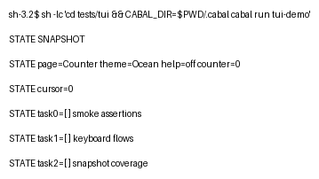
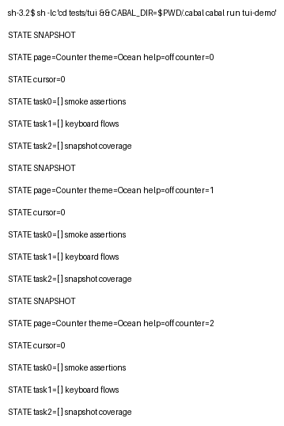
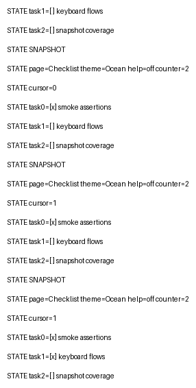
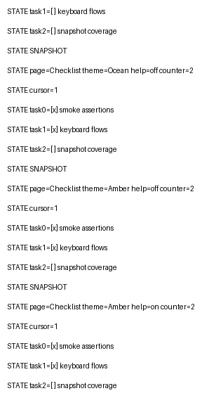
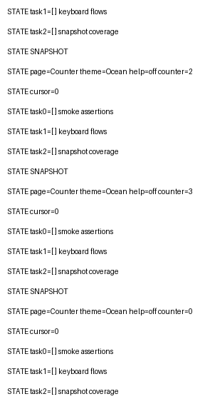

# tuispec

`tuispec` is a starter Haskell framework for black-box TUI testing with Playwright-like ergonomics.

Current starter status:
- shallow DSL for tests
- sequential runner with retries
- PTY transport only (no fallback backend)
- artifact folder scaffolding
- snapshot baselines (`snapshots/`) with PNG + text comparison
- PNG rendering via `python3` + Pillow
- `tuitest` CLI command shape (`run`, `list`)

## Quick start

Build:

```bash
cabal build
```

Run the smoke test:

```bash
cabal test
```

Run a test script directly:

```bash
cabal run tuitest -- run test/Spec.hs
```

Run with overrides:

```bash
cabal run tuitest -- run test/Spec.hs --timeout 10 --retries 1 --update-snapshots
```

List tests from a script:

```bash
cabal run tuitest -- list test/Spec.hs
```

## Layout

- `src/TuiSpec.hs`: public API
- `src/TuiSpec/Types.hs`: DSL and configuration types
- `src/TuiSpec/Runner.hs`: starter runner implementation
- `app/Main.hs`: `tuitest` CLI entrypoint
- `test/Spec.hs`: smoke test example
- `tuispec-v1-spec.md`: project specification

## Brick Example Artifacts

These images are committed from a real run of `test/BrickDemoSpec.hs`.

- [Brick report (Markdown)](docs/brick-example/report.md)
- [Brick report (JSON)](docs/brick-example/report.json)
- [Brick spec](test/BrickDemoSpec.hs)
- [Brick app](tests/tui/app/Main.hs)







## Notes

- PNG snapshot rendering uses `python3` with Pillow (`PIL`).
- Snapshot baselines are anchored to the detected project root (or `TUISPEC_PROJECT_ROOT` when set), not the launch directory.
- If PTY cannot be started in the current environment, tests fail fast.
- `tuitest run` flags currently map to environment overrides consumed by `runSuite` (timeout, retries, artifacts dir, ambiguity mode).
